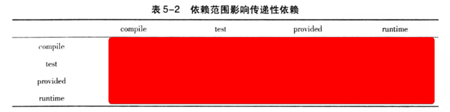
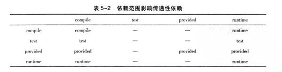
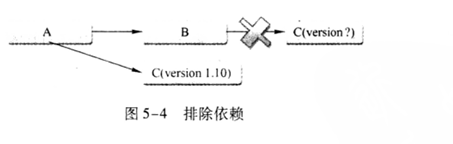

### windows上安装Maven
- {{c1::环境变量`M2_HOME`：Maven安装目录}}
- {{c1::环境变量`Path`:添加`"%M2_HOME%\bin"`}}
- {{c1::管理员运行命令行检查安装情况：`mvn -v`}}
### .m2文件夹的作用
- 位置：{{c1::~/.m2}}
- .m2/repository ：{{c1::本地仓库}}
- .m2/settings.xml：{{c1::本地Maven配置文件}}
### 配置HTTP代理的作用(实践搜索)
- 背景：公司不允许直接访问外部网络，需要经过代理验证（比如在安全限制上设置了白名单网站），这时，maven需要通过配置http代理访问中央仓库（repo1.maven.org）
- 搜索：MAVEN配置HTTP代理

### MAVEN_OPTS环境变量的作用
+ 通常需要设置MAVEN_OPTS的值为:{{c1::`-Xms128m  -Xmx512m`}}
+ 含义：{{c1:: 因为Java默认的最大可用内存往往不够满足Maven运行需要，比如较大的项目时，使用Maven生成项目站点需要占用大量内存。如果没有该配置，则很容易得到java.lang.OutOfMeneoryError。因此，一开始就配置该变量是推荐的做法。}}

### pom.xml文件中概要
|  元素  | 意义  |
|  ----  | ----  |
|`<modelVersion>`元素 | {{c1::当前POM模型的版本}}
|`<groupId>`元素 | {{c1::定义项目属于哪个组，通常与公司域名关联，建立一个myapp组为`com.google.myapp.`}}
|`<artifactId>`元素 | {{c1:: 当前项目在组中的唯一ID }}
|`<version>`元素 | {{c1:: 定义项目版本,1.0.SHNAPSHOT,其中SHNAPSHOT代表快照版本 }}
|`<name>`元素|{{c1::可选的，声明一个对用户友好的项目名称。}}|
|`<packaging>`元素|{{c1::可选的，打包方式默认为jar。}}|

### maven项目主要骨架
+ {{c1:: ./src/main/java }}
+ {{c1:: ./src/main/resources }}
+ {{c1:: ./src/test/java }}
+ {{c1:: ./src/test/resources }}
+ {{c1:: ./pom.xml }}

### maven的默认编译使用的jdk版本是1.3,如何解决？（实践搜索）
+ {{c1:: maven会用maven-compiler-plugin默认的jdk版本来进行处理，以至于可能导致编译不通过的问题，需要显示在pom文件中配置插件。}}
+ {{c1::搜索：maven-compiler-plugin}}

### maven配置生成可执行的jar（搜索）
含义：{{c1::maven默认打包生成jar是不能直接运行的，因为带有main方法的类信息不会添加到MANIFEST.MF文件,需要配置.}}
搜索:{{c1::`maven-shade-plugin`}}

### 使用archetype生成项目骨架
{{c1::
简单运行命令行：mvn archetype:generate
}}
### maven官方插件坐标的格式
{{c1::
```xml
<groupId>org.apache.maven.plugins</groupId>
<artifactId>maven-shade-plugin</artifactId>
```
}}

### 项目构件的文件名生成规则
一般规则为：{{c1:: `artifactId-version [-classifer] .packaging` }}

### 依赖范围与classpath之间的关系

- 3种classpath：{{c1::编译classpath，测试classpath，运行时classpath。}}
- 5种依赖范围：
  1. compile: {{c1::都有效，例子：spring-core}}
  2. test: {{c1::只对测试有效 例子：JUnit}}
  3. provided: {{c1::只对运行时无效，例子：servlet-api}}
  4. runtime: {{c1::只对编译无效，例子：JDBC驱动实现。}}
  5. System:{{c1::与provided一致，代表本地的，仓库之外的，需要配置systemPath元素。}}

### 依赖范围对传递性依赖的影响

{{c1::  }}

### 依赖冲突原则

有依赖关系如下：
1. A->B->C->X（1.0）、A->D->X（2.0）
2. A->B->X（1.0）、A->C->X（2.0）
分别对应什么依赖调解原则？
1. {{c1:: 最短路径优先：X(2.0) }}
2. {{c1:: 第一声明优先：X(1.0) }}

### `<dependency>`子元素`<optional>`的作用：

{{c1:: 可选的，当optional为true时，<dependency>引用的依赖不会被传递给当前项目的引用者，通常需要引用者自己提供一个代替依赖。}}

### `<exclusion>`元素的使用场景以及使用例子

{{c1::



}}

+ {{c1:: 通常用于修改某个间接依赖版本。}}


{{c1:: 
```xml
    <exclusions>  
        <exclusion>  
            <groupId>org.springframework</groupId>  
            <artifactId>spring-beans</artifactId>  
        </exclusion> 
    <exclusions>
```
}}
### pom.xml中<properties>元素的使用
{{c1::
```xml
<properties>
 <spring.version>1.2.6</spring.version>
</properties>
```
```xml
<dependency>
 <groupId>org.springframework</groupId>
 <artifactId>spring-core</artifactId>
 <version>${spring.version}</version>
</dependency>
<dependency>
 <groupId>org.springframework</groupId>
 <artifactId>spring-aop</artifactId>
 <version>${spring.version}</version>
</dependency>
```
}}